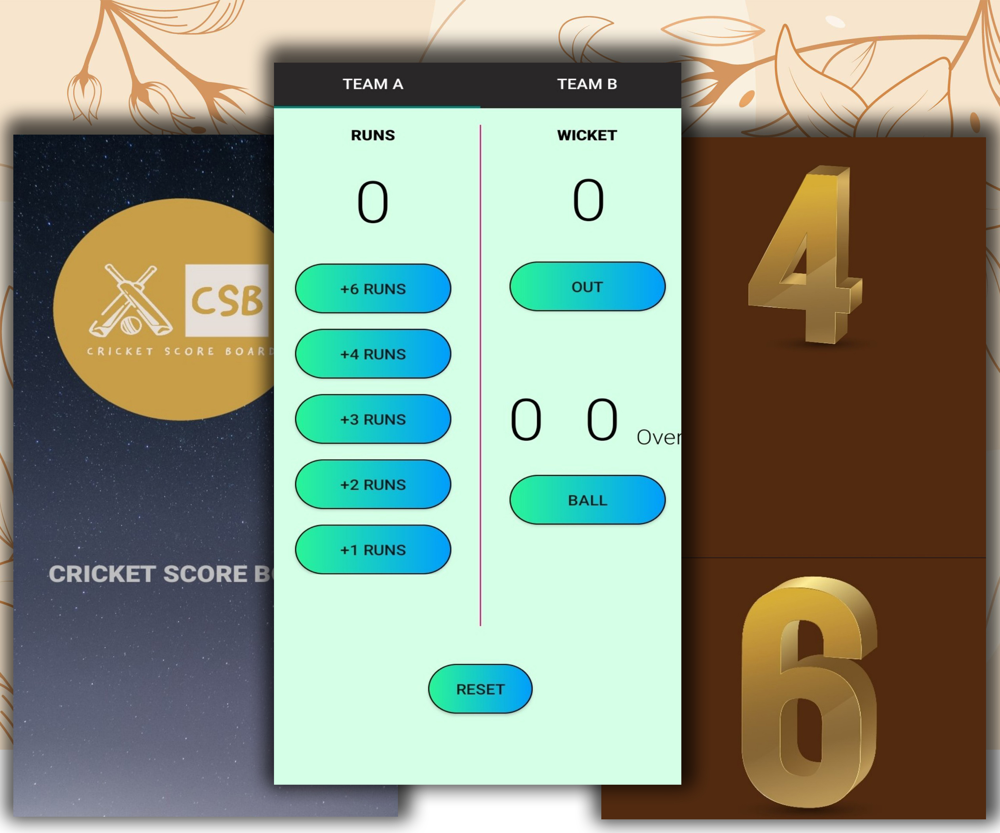
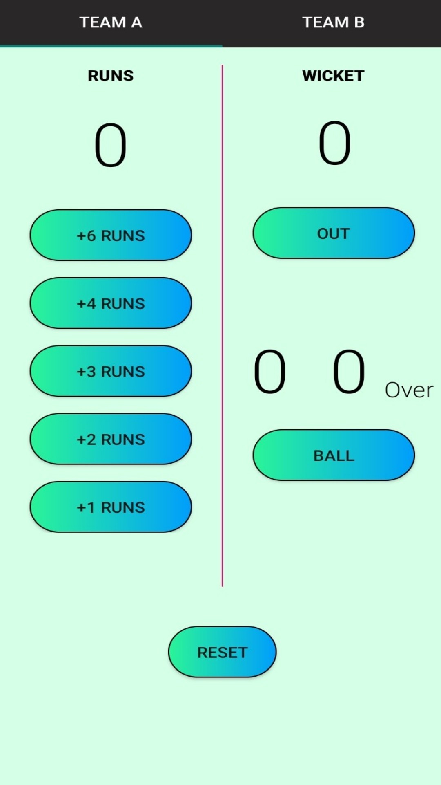
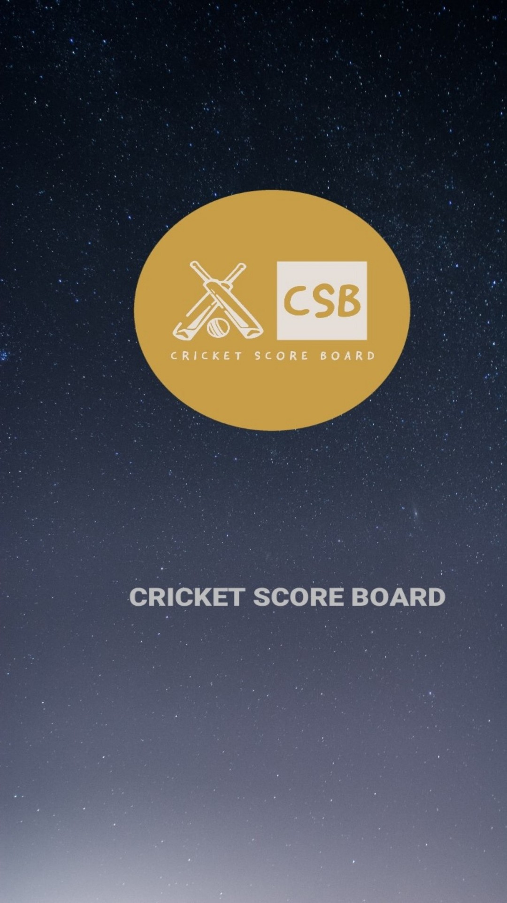

# SimpleBatBall
A simple Cricket Score Board App. It provides a user-friendly interface. Its a project for increasing my learnign scope in Android App Development. Learnt Fragments and inteds.

## Screenshots

Here are some screenshots of the Cricket Score Board:
<div align="center">
  
  
  
  
  
</div>

## Installation

Clone the repository:

```bash
git clone https://github.com/rifaturrana/SimpleBatBall
```
## Product features
Show toast when batsman Score Six or Four Runs
Show toast when fall a wicket
Show toast with background commentary

## Product description
Cricket is the most played sport in the world. From child to adult everybody loves playing cricket. In every country people love to play Gully Cricket but sometimes its difficult to store the scores. So here is the app for this.
- Store Runs
- Show Wickets
- Show Overs

## Get it on Amazon Apps
[](https://www.amazon.com/gp/product/B08HXBLRLD)
 ## License

This package is open source and available under the MIT License. Feel free to use it in your projects, modify it, and redistribute it as needed.

## Contributing

Contributions are welcome! If you would like to contribute to this project, please read the CONTRIBUTING file for more information.

## Issues

If you find a bug or have a feature request, please create an issue on the issue tracker.


## Support

If you need help or have questions about Secure-pass-generator, please contact me at smrifaturrana@gmail.com.
